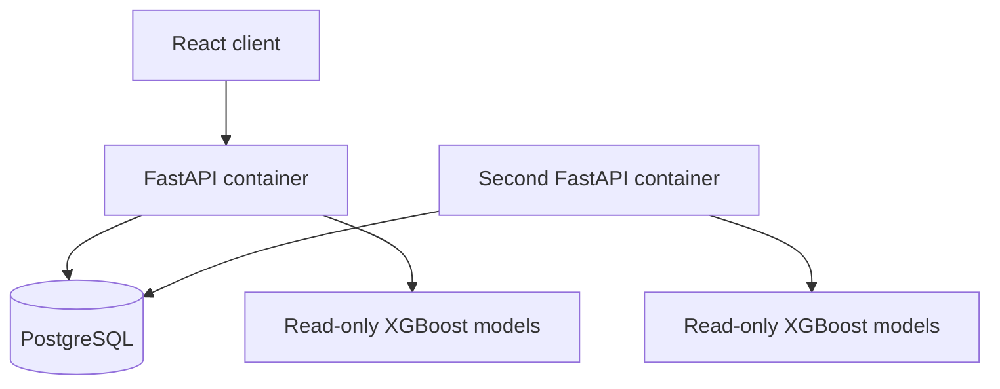

# CoordinAIte Backend Architecture

## Current milestone

The API is a stateless modular monolith. A container keeps only immutable,
read-only model objects in memory. All mutable live-game state is stored in
PostgreSQL and addressed by a random `game_id`.

This means either API container can handle the next request for a game. There
is no process-wide `GameTracker` and no requirement for sticky sessions.

## Request lifecycle

1. Login returns a signed access token and a rotating HttpOnly refresh cookie.
2. `POST /set-teams` creates a durable game owned by the authenticated user,
   or a guest game with a separate private access token.
3. The client sends the `game_id` plus its credentials. The API checks ownership
   and locks the matching row for a mutation.
4. It hydrates a request-local `GameTracker` from `tracker_state`.
5. It runs the prediction or mutation using the shared model bundle.
6. It writes the new tracker state, increments `version`, and commits.
7. Read endpoints load the same state without changing it.

PostgreSQL row locks serialize concurrent mutations for the same game while
allowing unrelated games to update independently. The `version` field makes
state transitions visible and provides a foundation for optimistic concurrency
control if a future client needs it.

## Package boundaries

| Package | Responsibility |
| --- | --- |
| `app/api/routes` | HTTP parsing, status codes, and response contracts |
| `app/core` | Environment configuration and security primitives |
| `app/db` | SQLAlchemy metadata, models, engines, and sessions |
| `app/services` | Game-session and subscription business rules |
| `game_tracker.py` | Prediction behavior and serializable game state |
| `alembic` | Repeatable database schema migrations |

`backend/main.py` is intentionally a small compatibility entry point so the
existing Render start command can remain `uvicorn main:app`.

## Why PostgreSQL before Redis

PostgreSQL is currently the system of record and is sufficient for the expected
traffic. Adding Redis now would create two sources of truth and a cache
invalidation problem without evidence that database latency is limiting the
product.

Redis becomes useful later for:

- rate limiting;
- short-lived response caching;
- distributed task queues;
- ephemeral locks at much higher request volume.

Live games should still be recoverable from PostgreSQL after a Redis restart.

## Failure behavior

- A container restart loses no live game state.
- A request sent to a different container observes the committed state.
- A failed transaction does not partially update a game.
- An invalid or missing `game_id` cannot fall back to another user's tracker.
- `/health/live` reports process health.
- `/health/ready` checks the database and loaded prediction model.

## Verification

The backend test suite proves both isolation and shared persistence:

- two games cannot overwrite each other's teams or play counters;
- a second API application instance can read a game created by the first;
- serialized tracker state preserves live tendency counters.
- invalid/expired JWTs cannot authenticate;
- another account cannot read, mutate, save, resume, or delete a game;
- refresh cookies rotate and previously used values are rejected;
- logout revokes access across API instances;
- migrations preserve existing accounts and saved games.

Authentication and its local/deployment configuration are documented in
[authentication.md](authentication.md). JWTs do not contain subscription rights;
Tier 2 authorization reads the current account record on each request. Database
login sessions support immediate revocation without process-local session state.

## Planned evolution

1. Production auth hardening: rate limits, account recovery, email verification,
   expired-session cleanup, and stronger refresh-token reuse detection.
2. Normalized `plays` and `predictions` tables for analytics and model audits.
3. Docker Compose and CI checks for migrations, tests, and frontend builds.
4. Redis-backed rate limiting and background jobs where measurements justify it.
5. ECS Fargate, RDS, ElastiCache, S3, ECR, CloudWatch, and Terraform.
