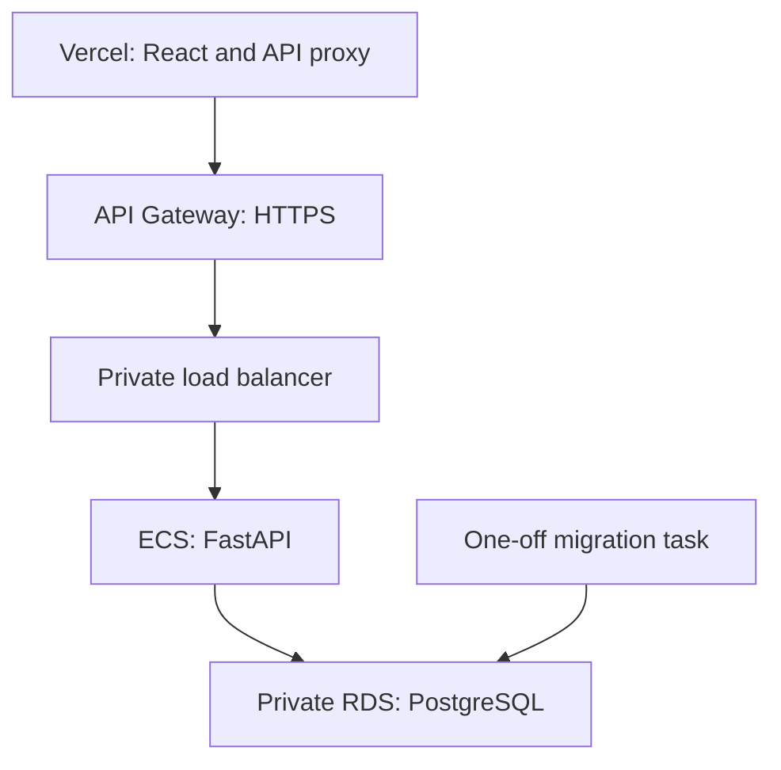

# CoordinAIte: move from Render to AWS

This release prepares the existing FastAPI application for ECS Fargate and
Amazon RDS PostgreSQL. The old Render database is unavailable, and a fresh
database has been authorized. The React frontend stays on Vercel.

The AWS infrastructure and application have now been deployed. Sections 1-5
remain the provisioning runbook; an existing installation should follow the
release and billing steps without recreating its infrastructure.

## What runs where

| Component | Location | Purpose |
|---|---|---|
| React frontend | Existing Vercel project | Serves the UI and proxies /api requests |
| HTTPS endpoint | API Gateway HTTP API | Supplies an HTTPS address without buying a domain |
| Internal load balancer | AWS VPC | Routes requests to healthy API containers |
| FastAPI and model files | ECS Fargate, images in ECR | Runs one stateless API task initially |
| Accounts, sessions, games | RDS PostgreSQL 17 | Durable application state |
| Credentials | Secrets Manager | Keeps passwords and signing keys out of source and Terraform state |
| Logs | CloudWatch | Application and HTTP request logs, retained for 14 days |
| Infrastructure state | Private, versioned S3 bucket | Shared Terraform state with locking |



The database and load balancer have no public internet endpoint. API tasks use
public subnets for outbound image downloads and Stripe calls, avoiding a NAT
gateway. Their security group accepts API traffic only from the load balancer;
the database accepts connections only from the task security group. Database
connections verify the RDS TLS certificate.

Defaults are one API task and a single-AZ database with seven days of backups.
This is a small initial deployment; it does not provide database standby
failover. Two API tasks and `db_multi_az = true` can be enabled later after
reviewing the cost and load requirements. Redis and a training queue are not
needed for this release.

## Cost and access before provisioning

AWS charges separately for Fargate, the database and storage, the load balancer,
public IPv4 addresses on tasks, API requests, secrets, logs, and image storage.
Do not assume account credits make the whole deployment free. Review this exact
stack in the [AWS Pricing Calculator](https://calculator.aws/) and set a billing
alert before creating it. Alerts are notifications, not spending limits.

Relevant rates: [Fargate](https://aws.amazon.com/fargate/pricing/),
[RDS PostgreSQL](https://aws.amazon.com/rds/postgresql/pricing/),
[load balancing](https://aws.amazon.com/elasticloadbalancing/pricing/), and
[API Gateway](https://aws.amazon.com/api-gateway/pricing/).

Use a non-root AWS deployment identity, preferably through IAM Identity Center
and AWS CLI SSO. The one-time infrastructure identity needs permission to create
the listed services, networking, IAM roles, and an OIDC provider. The generated
GitHub deployment role is scoped to publishing this app and releasing its ECS
tasks. It cannot change the database infrastructure and has no direct Secrets
Manager read permission. Anyone able to release application code still controls
code that runs with the application's credentials.

Do not paste access keys or passwords into chat or commit them to Git.

## 1. Apply and check the release locally

From your existing production-backend branch with a clean working tree:

```powershell
cd C:\Users\zakia\football-ai
git status
git switch -c deploy/aws-foundation
git am "$env:USERPROFILE\Downloads\coordinaite-phase3-aws-foundation.patch"
git remote set-url origin https://github.com/braylonwatson/CoordinAIte.git
git push -u origin deploy/aws-foundation
```

The CI workflow runs backend tests against disposable PostgreSQL, the frontend
tests and build, Terraform validation, and an API container smoke check using the
real model files. Resolve failures before provisioning or publishing a release.
There are no AWS credentials in this CI workflow.

Optional local container check, with Docker Desktop running:

```powershell
$env:JWT_SECRET_KEY = python -c "import secrets; print(secrets.token_urlsafe(48))"
docker compose up --build
```

This uses a new Docker volume and exposes PostgreSQL on localhost:5433, leaving
your existing local PostgreSQL on port 5432 alone. Start React as before with
`REACT_APP_API_URL=http://localhost:8000`. Both browser hosts must use localhost.
`docker compose down` retains the database volume.

## 2. Prepare your AWS tools and account

Install AWS CLI v2, Terraform 1.10 or later, Docker Desktop, and Python 3.11.
Terraform 1.16.3 is selected in CI. Run each command separately and stop on errors.

```powershell
aws configure sso --profile coordinaite
aws sso login --profile coordinaite
$env:AWS_PROFILE = "coordinaite"
aws sts get-caller-identity
python -m pip install -r scripts/requirements.txt
python scripts/aws_setup.py state --region us-east-1
```

The state command creates a private S3 bucket with encryption, versioning,
HTTPS-only access, and a local backend configuration. It does not create the
application, database, or any containers.

## 3. Review and create the infrastructure

```powershell
Copy-Item infra/aws/terraform.tfvars.example infra/aws/terraform.tfvars
notepad infra/aws/terraform.tfvars
```

Replace the example `frontend_url` with your exact production Vercel origin.
The existing Vercel project is named football-ai, but its production domain must
be verified in your dashboard. Keep the region consistent with the state setup.

If this AWS account already has a GitHub OIDC provider, set
`github_oidc_provider_arn` to its ARN; this avoids trying to create a duplicate.

```powershell
terraform -chdir=infra/aws init -backend-config=backend.hcl
terraform -chdir=infra/aws validate
terraform -chdir=infra/aws plan -out=aws.tfplan
```

Review the plan and monthly estimate. After deciding to create these resources:

```powershell
terraform -chdir=infra/aws apply aws.tfplan
python scripts/aws_setup.py export
python scripts/aws_setup.py secrets
```

The API service starts with zero tasks. The secrets command initializes a random
application database password and JWT signing key directly in Secrets Manager.
It preserves existing values when rerun. No passwords are printed or written to
the repository. The database master password is managed separately by RDS.

The generated `release-config.json` contains resource identifiers and public
URLs, not credentials. Re-export it after changing infrastructure.

## 4. Build and deploy the backend

Docker Desktop must be running in Linux container mode:

```powershell
$release = Get-Content release-config.json -Raw | ConvertFrom-Json
$registry = ($release.repository_url -split "/")[0]
$commit = git rev-parse --short HEAD
$tag = "$commit-$(Get-Date -Format yyyyMMddHHmmss)"
$image = "$($release.repository_url):$tag"
aws ecr get-login-password --region $release.region | docker login --username AWS --password-stdin $registry
docker build --platform linux/amd64 -t $image backend
docker push $image
python scripts/deploy_aws.py --image $image
```

The release script runs migrations as a separate ECS task before updating the
API. The migration task creates a restricted application login, grants access to
application tables, and keeps schema changes under a separate administrative
credential. A PostgreSQL advisory lock serializes migration tasks.

If migration fails, the API service is not updated. If the new API cannot become
healthy, ECS has deployment circuit-breaker rollback enabled. The script also
checks the active task definition, so a stable rollback is not reported as a
successful new release.

The script checks the public `/health/ready` endpoint before reporting success.
To deploy two API tasks, explicitly pass `--tasks 2`; otherwise later releases
preserve the existing task count.

## 5. Connect the Vercel frontend

After the AWS backend reports ready:

```powershell
python scripts/configure_frontend.py
git add frontend/vercel.json
git commit -m "Route frontend API requests to AWS"
git push
```

The generated Vercel configuration sends `/api/*` to the AWS HTTPS endpoint and
builds React with `REACT_APP_API_URL=/api`. It disables caching on API responses.
Use the existing Vercel project with Root Directory set to `frontend`, then
deploy the release branch to production through your usual Git/PR workflow.

This proxy keeps the refresh cookie on the frontend's own origin, avoiding a
dependency on third-party cookies. AWS sets it as Secure, HttpOnly,
SameSite=Lax, Path=/api/auth. Local development retains Path=/auth.

### Allow a Vercel branch preview to sign in

The backend checks the browser's exact `Origin` on login, signup, refresh, and
logout. A new Vercel preview can therefore load correctly and still return
`Untrusted authentication request.` when its origin is not configured. The
frontend must also send `X-CSRF-Protection: 1`; keep both checks enabled.

Keep `frontend_url` set to production. The approved branch preview is recorded in
`infra/aws/preview-origins.auto.tfvars`, which Terraform loads automatically:

```hcl
additional_frontend_origins = [
  "https://football-ai-git-perf-realtime-pr-9a97f4-braylonwatsons-projects.vercel.app",
]
```

Use the URL actually open in the browser, without a trailing slash or path.
Allowing the branch alias does not also allow individual deployment URLs. These
previews use the same AWS backend and account data as production. Only add
origins you control. Keep this allowlist in one file, and remove preview entries
when testing is complete.

Review and apply a Terraform plan, then run `python scripts/aws_setup.py export`.
Refresh `AWS_DEPLOY_CONFIG` if you use GitHub Actions. Terraform registers new
task definitions, but the service ignores task-definition changes: a subsequent
backend release using the refreshed configuration is required to activate the
allowlist. Keep the existing image when deploying only this configuration fix.
Do not change `FRONTEND_URL` to the preview or use a wildcard for Vercel domains.

This session's Vercel connection returned 403 for the existing project. Project
access must be resolved or this step completed from your Vercel dashboard.
GitHub integration writes were also denied; local Git pushes work.

## 6. Verify the live application and move billing

Create a new account, predict and log a play, save and resume a game, reload the
browser to confirm login persistence, and check two independent game sessions.
Use the incognito isolation check from the earlier milestone.

Stripe is initially unconfigured. Follow [the $10 Tier 2 billing runbook](stripe-billing.md)
to create the price and AWS webhook and populate the application secret:
`stripe_secret_key`, `stripe_price_id_tier2`, and `stripe_webhook_secret`.
Point Stripe's webhook to the new API origin plus `/stripe/webhook`, then
redeploy the API to load the updated secret. Test checkout and webhook delivery
before accepting payments. A new database does not cancel an existing Stripe
subscription or reconnect it automatically to a new user account.

After the AWS and Vercel flows pass, remove the old Render service and obsolete
Render webhook destination. No Render resources have been deleted by this patch.

## 7. Enable repeatable releases

Once these workflow files are on the default GitHub branch, create a GitHub
environment named `production`. Restrict its deployment branches to your
production branch and configure any desired reviewer protection.

Add an environment variable named `AWS_DEPLOY_CONFIG` containing the full
contents of `release-config.json`. No long-lived AWS access keys are required.
The AWS role trusts only this repository's production environment through OIDC.

Run the **Deploy AWS** workflow manually. It reruns CI, builds an immutable image,
runs the migration task, updates ECS, and checks readiness. Concurrent releases
are serialized. This workflow deploys application revisions; infrastructure
changes still require a reviewed Terraform plan.

When changing task configuration in Terraform, apply it and re-export the release
configuration before the next release. ECS task-definition changes are picked up
by the release script, not by the Terraform service's ignored revision field.

## Operational boundaries and rollback

- Database backup retention is seven days. Test a restore before relying on it.
- Application rollbacks require schema compatibility. Do not automatically run
  Alembic downgrades against production data; use additive migrations first.
- The API uses a restricted database login. Add explicit grants in the migration
  script when introducing new tables.
- Secrets are injected when tasks start. Updating a secret requires a new task
  rollout; application database password rotation also requires updating the
  database role before reconnecting clients.
- VPC links can become inactive after long periods without requests. Consult
  AWS's VPC link documentation if the first request after extended inactivity
  needs a warm-up period.
- Terraform protects the database from deletion and requires a final snapshot.
  For deliberate teardown, first disable database deletion protection through a
  reviewed apply. Choose a unique final snapshot identifier if one already exists.
  The state bucket, snapshots, and image storage can continue to incur charges
  after containers stop.

## Verification recorded while preparing this release

- Backend: 38 tests passed locally.
- Release safety: 3 tests passed (failed migration, rollback detection, wrong image).
- Frontend: 7 tests passed; production build with /api compiled.
- Real PostgreSQL integration tests were added to CI; skipped locally because this
  execution environment has no PostgreSQL server or Docker runtime.
- Terraform was formatted and syntax-checked. Full provider validation is blocked
  here because this environment prohibits the provider's local Unix socket.
  The CI workflow runs full Terraform validation on a normal GitHub runner.
- No AWS plan, apply, image deployment, or live AWS verification has run.
